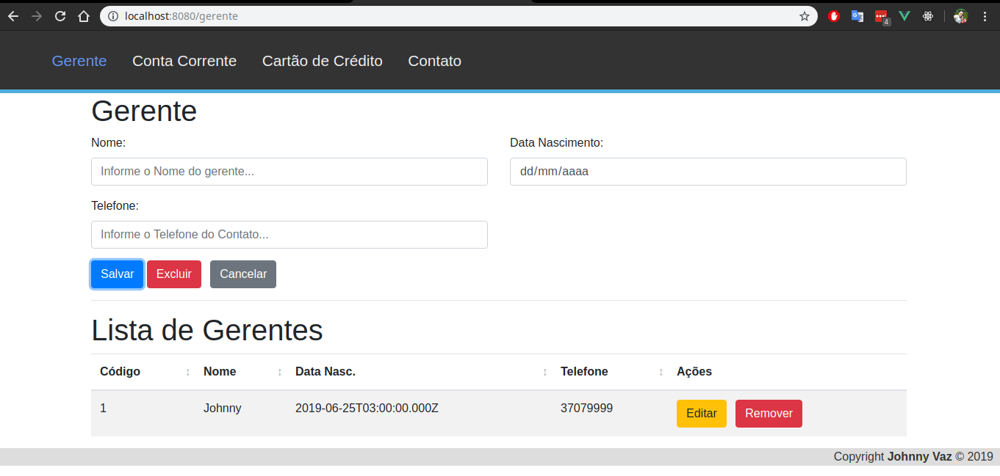

# SISTEMA CRUD BÁSICO
BACK
EXPRESS + KNEX

FRONT
VUE

# Instalação
## Back
1 - O backend precisa configurar o arquivo .env com o caminho do banco de dados
2 - Npm install
3 - npm start
## Front
1 - npm i
2 - npm run dev

